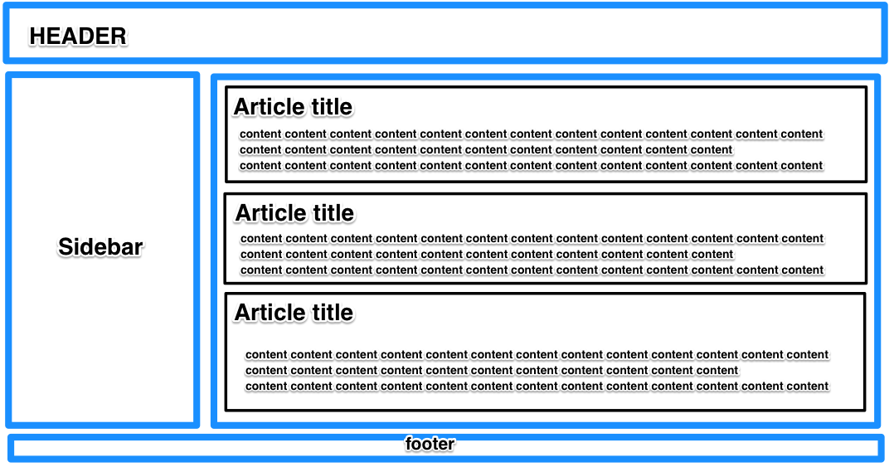

# 4. HTML & CSS
## HTML Training

1. Download the HTML boilerplate project
2. Create an HTML page for a basic news site, like in the example below. Use new HTML5 tags like aside, section, header, footer etc. __NO NEED TO ADD CSS__
3. Add the following elements to the page from [this article](https://code.tutsplus.com/tutorials/28-html5-features-tips-and-techniques-you-must-know--net-13520):
  - Make your content editable
  - Add email inputs
  - Add username & password inputs __with placeholders__
- Upload the __final__ HTML file (call it HTML_only.html) to a new repository on Github, call it `html-and-css`

Example:

## CSS with Flexbox training
1. Go over the course [examples of Flexbox](https://github.com/LeonLiber/fullstack-course/tree/master/4.%20HTML%20and%20CSS/Flexbox%20examples)
2. Complete all levels of [Flexboxfroggy](http://flexboxfroggy.com/), save the solutions in a TXT file called `flexboxfroggy.txt` and upload to github `html-and-css` repository
3. Add  styling to the HTML page from HTML training above to make it look like the example. Use external stylesheet [(hint)](https://philipwalton.github.io/solved-by-flexbox/demos/holy-grail/)
